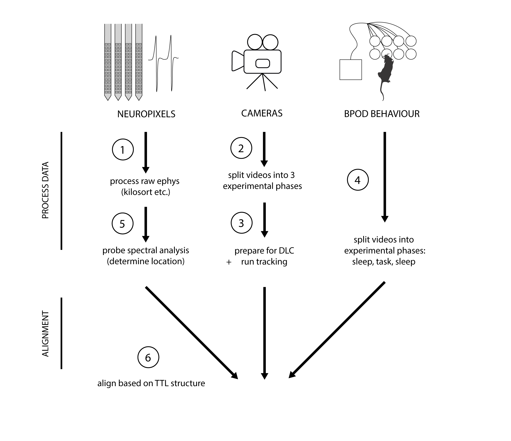
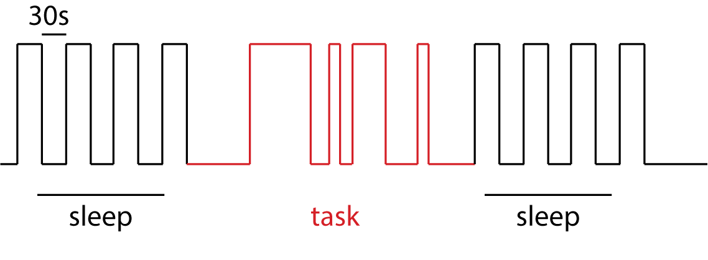

Emmett James Thompson
# Neuropixel data preprocessing
scripts for processing data collected during ephys recordings for the 8 port sequence task

- See our publication for more details: [Replay of Procedural Experience is Independent of the Hippocampus](https://www.biorxiv.org/content/10.1101/2024.06.05.597547v1.full.pdf).

# Overview: 
- there are three main data streams (ephys, behaviour and video data)
- each of these need to be processed intially (scripts 1-5)
- then finally these data streams are aligned and a synchronisation file is created=
- these scripts produce processed data in a clean organised file structure
  

# Data collection:
This processing pipeline assumes the following data collection methods:
- Neuropixels (1.0 or 2.0) collected using Open Ephys
- Behaviour data collected with Bpod using sequence task protocol "Sequence Automated"
- FLIR Cameras aligned above and below the task/sleep arenas, set with GPIO receiveing triggers, avi and stamps data saved via bonsai
- Synchronisation (see TTL alignment below)

# Processing pipeline: 
The code is organised into 6 scripts which should be executed in order:

1.  Takes the raw ephys (OE output) and uses the spike interface architecture to create a probe object (an active channel map) and subsequentloy spikesort the data (using Kilosort 4).
  
As well as spike interface (https://spikeinterface.readthedocs.io/en/stable/) this step requires kilosort 4 is installed (https://github.com/MouseLand/Kilosort). Ksort is not very fast but will run much faster if it has access to a gpu. See the file called HPC_helpsheet for tips on running this code on the cluster.

- 2: this script...
- 3:
- 4:
- 5:
- 6:
  

  

# TTL alignment (synchronisartion) structure: 

Bpod (behvaioural controller) acts as the central clock, sending TTLs to the ephys niDAQ and the camera GPIO pins. 

The recording epoch is split into sleep and task periods. During sleep Bpod acts like a heart beat, sending pulses every 30s. During the task, TTLs are sent based on the trial structure (ITI depends on the behaviur of the mouse)

TTL output during the task goes high at trial start (when bpod loads a new trial), and stays high until the mouse pokes into the first task port in the sequence (ie. port 1 of 5, not just any port!) 

## Getting Started

Ensure you have the following software installed:
- [Git](https://git-scm.com/)
- [Python](https://www.python.org/downloads/)  (Version used: 3.12.3)
- Jupyter notebook
- Necessary Python libraries: this pipeline worked with the environment I have listed in requirements.txt (though some of these packages may be redundant..also some may be missing, but they should be easy to find!)
- IMPORTANT! make sure to use moviepy version 1.0.3. the newer one at time of writing (december 2024) seems to be broken 

